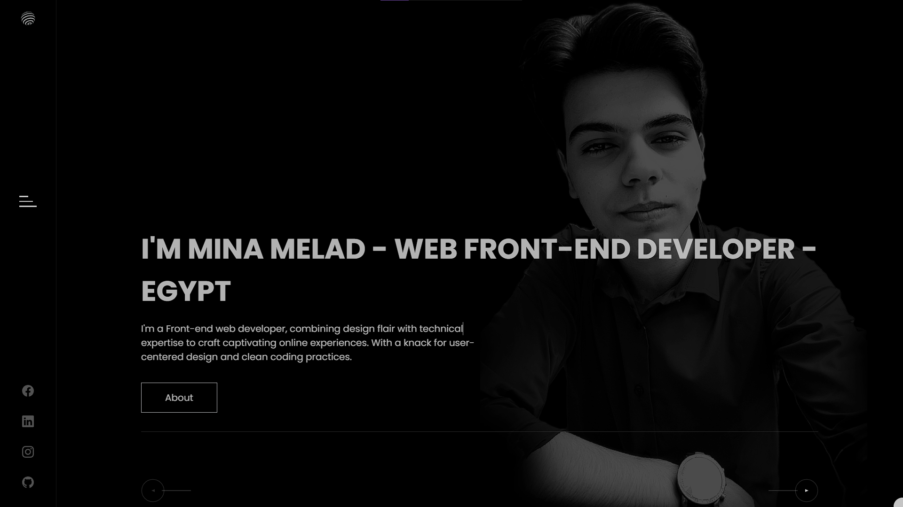
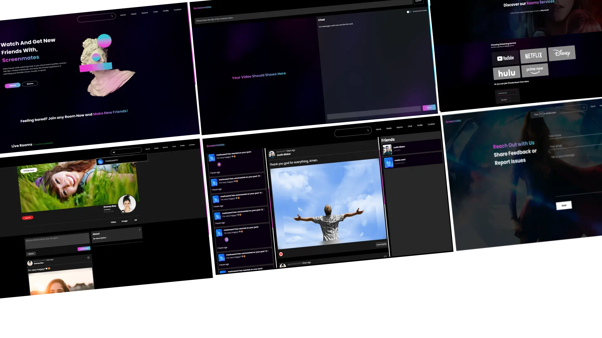
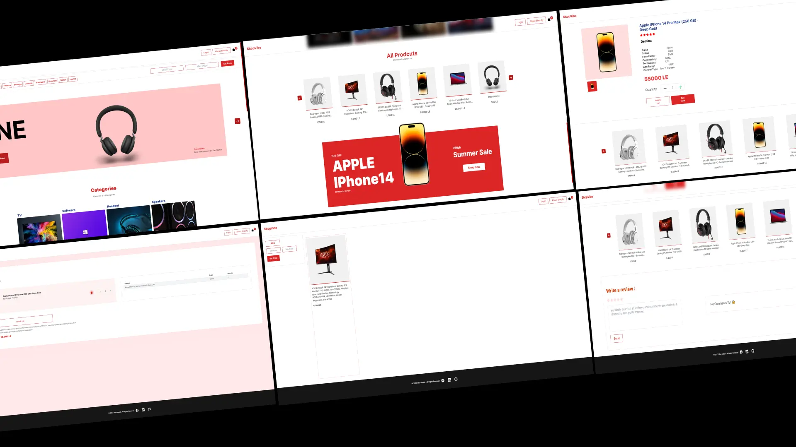
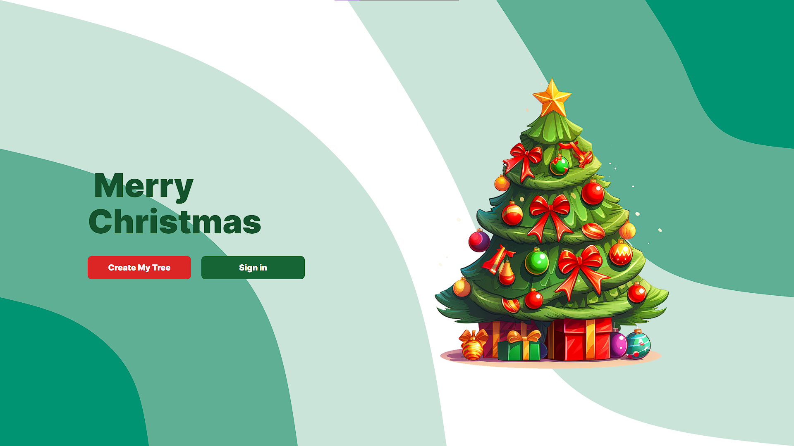
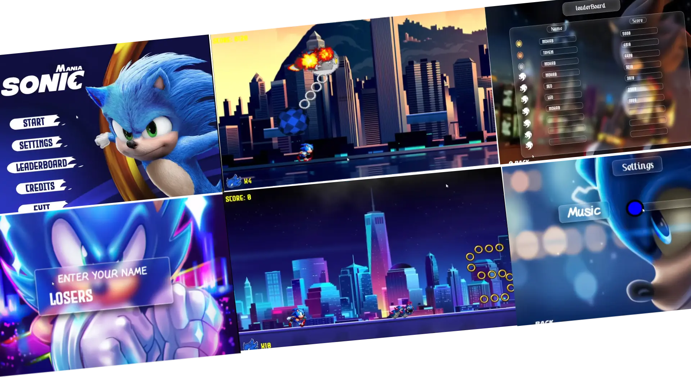
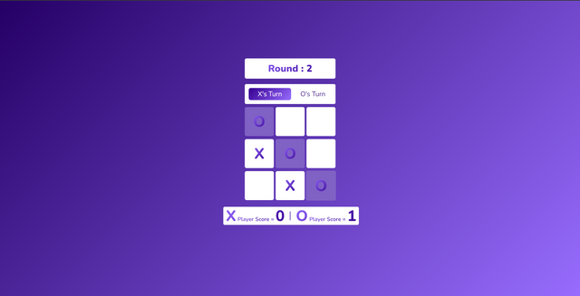
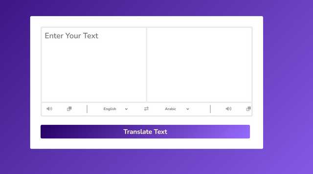

<h2 align="center">Hello, <a href="https://github.com/Mina-Massoud"  
  title="Profile">I'm Mina</a>👋</h2>
 

  I'm a 20 years old Software Engineer based in Egypt 
  I'm passionate about creating intuitive and dynamic user experiences. With a background in front-end web development and a keen eye for design, I always strive to build websites that are 
  both visually compelling and functionally effective.
  
  
  📫 How to reach me:

  
  

 

  

<h1 align="center">🚀 Languages & Tools</h1>

<h3 align='center'>🏝️ Front End</h3>

<table align="center" width:"100%">
  <tr>
    <td align="center" height="70" width="70">
      
       HTML5
    </td>
    <td align="center" height="70" width="70">
      
       CSS3
    </td>
    <td align="center" height="70" width="70">
      
       JavaScript
    </td>
    <td align="center" height="70" width="70">
      
       React
    </td>
  </tr>
  <tr>
    <td align="center" height="70" width="70">
      
       Next.js
    </td>
    <td align="center" height="70" width="70">
      
       Redux
    </td>
    <td align="center" height="70" width="70">
      
       Tailwind
    </td>
  </tr>
</table>

<h3 align='center'>⚗️ Tools</h3>

<table align="center">
  <tr>
    <td align="center" height="70" width="70">
      
       Git
    </td>
    <td align="center" height="70" width="70">
      
       Vite
    </td>
    <td align="center" height="70" width="70">
      
       Figma
    </td>
  </tr>
</table>

 

<h1 align="center">Projects</h1>

<h2 align="center">Biggest Projects First</h2>

<table>
  <tr>
    <!-- <td width='50%'></td> -->
      <td width='50%' colspan=2>
      <h2 align='center'>Portfolio</h2>
      
  
        
         
         
        

          
        

        
<strong>React, Framer motion, Tailwind CSS, Sanity </strong>

      

    </td>
     <tr>
      <tr>
     <td width='50%'  colspan=2>
      <h2 align='center'>ScreenMates</h2>
      
  
        
         
         
        

          
          
          
        

        
<strong>React, Socket IO, NodeJS, Express, MongoDB, Cloudinary, </strong>

      

    </td>
  </tr>
  <tr>
    <td width='50%'>
      <h2 align='center'>ShopVipe</h2>
      
  
        
         
         
        

          
        

        
<strong>React, TailwindCSS, GoogleAUTH, Sanity</strong>

      

    </td>
    <td width='50%'>
      <h2 align='center'>Decorate my tree</h2>
      
  
        
         
         
        

          
        

        
<strong>React, FramerMotion, NodeJs, Express, MongoDB</strong>

      

    </td>
  </tr>
   <tr>
    <td width='50%'>
      <h2 align='center'>Sonic Mania</h2>
      
  
        
         
         
        

          
        

        
<strong>C++, SFML, Problem Solving, Figma</strong>

      

    </td>
    <td width='50%'>
      <h2 align='center'>ChatVibes</h2>
       
  
        
         
        

         
        

        
<strong>Data Structure, OOP, C++, QT</strong>

      

    </td>
  </tr>
  <tr>
    <td width='50%'>
      <h2 align='center'>XO</h2>
      
  
        
         
         
        

          
            
        

        
<strong>HTML, CSS, JavaScript</strong>

      

    </td>
    <td width='50%'>
      <h2 align='center'>Translation</h2>
      
  
        
         
         
        

         
        

        
<strong>HTML, CSS, JavaScript</strong>

      

    </td>
  </tr>
  <tr>
</table>
